# Vaibhav Chauhan — Data Analyst Portfolio

> A premium, dark-first, scroll-animated portfolio showcasing data analytics expertise, dashboards, and ML systems. Built with Next.js 14, TypeScript, Tailwind CSS, GSAP animations, and Spline 3D.

**Live:** [vaibhavchauhan.dev](https://vaibhavchauhan.dev) | **GitHub:** [@vaibhavchauhan-15](https://github.com/vaibhavchauhan-15) | **LinkedIn:** [vaibhavchauhan15](https://www.linkedin.com/in/vaibhavchauhan15/)

---

## Table of Contents

1. [Overview](#overview)
2. [Tech Stack](#tech-stack)
3. [Features](#features)
4. [Project Structure](#project-structure)
5. [Quick Start](#quick-start)
6. [Environment Setup](#environment-setup)
7. [Portfolio Sections](#portfolio-sections)
8. [Customization Guide](#customization-guide)
9. [Performance & Accessibility](#performance--accessibility)
10. [Deployment](#deployment)
11. [Contributing](#contributing)
12. [License](#license)

---

## Overview

This is a **full-stack Next.js portfolio** built to showcase data analytics expertise with a focus on:
- **Visual excellence:** Dark-first design with scroll-triggered animations
- **3D interactivity:** Embedded Spline 3D scene in the hero
- **Performance:** Adaptive rendering engine that detects device capabilities
- **SEO & Analytics:** Vercel Analytics, dynamic OG images, sitemap, robots.txt
- **Accessibility:** Keyboard-navigable, WCAG 2.1 compliant, reduced-motion support
- **Contact:** Resend email integration for form submissions

**Target audience:** Recruiters, hiring managers, data teams, startups looking for a data analyst with full-stack capabilities.

---

## Tech Stack

### Core Framework
- **Next.js 14** (App Router, React Server Components, ISR)
- **React 18.3** with TypeScript 5.6
- **Node.js** (build/runtime)

### Styling & UI
- **Tailwind CSS 3.4** with CSS custom properties (design tokens)
- **CVA (Class Variance Authority)** for component variants
- **shadcn/ui** inspired component patterns

### Animations & Interactivity
- **GSAP 3.13** (ScrollTrigger, SplitText, DrawSVG)
- **Framer Motion 11** (component-level animations)
- **Lenis 1.1** (smooth scroll, synced to GSAP ticker)
- **Spline 3D** (interactive 3D hero scene, lazy-loaded, tier-gated)

### Forms & Validation
- **React Hook Form 7.53**
- **Zod 3.23** (schema validation)
- **@hookform/resolvers** for Zod integration

### Backend & Email
- **Resend 4.0** (transactional email API)
- **Next.js API routes** (`/api/contact`)

### Theming & Utilities
- **next-themes 0.4** (`data-theme` attribute, system preference sync)
- **lucide-react** (icon library)
- **clsx** & **tailwind-merge** (class composition)
- **react-intersection-observer** (lazy rendering, visibility detection)

### Analytics & Performance
- **Vercel Analytics** (Web Vitals tracking)
- **Custom Performance Provider** (device tier detection: CPU, RAM, GPU, network, refresh rate)

### Dev Tools
- **ESLint 8.57** (code quality)
- **TypeScript 5.6** (type safety)
- **PostCSS 8.4** + **Autoprefixer**

---

## Features

### ✨ Interactive Sections

#### 1. **Hero Section**
- Full-viewport hero with animated gradient background
- Embedded Spline 3D scene (tier-gated, static fallback on low-end devices)
- CTAs: "Get Resume" (PDF download), "Let's Talk" (scroll to contact)
- Smooth scroll-into-view with parallax effects

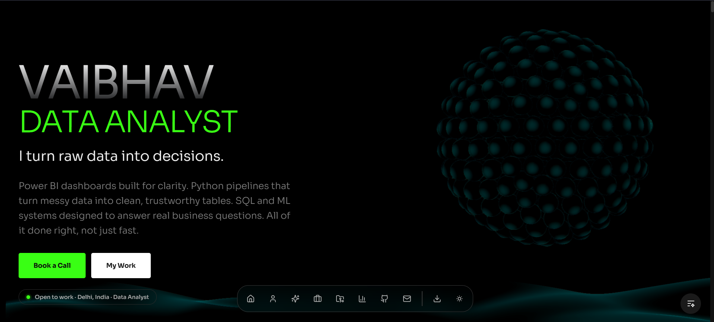

#### 2. **About Section**
- Professional bio with reveal animations
- Profile photo from Assets
- Animated counter showing years of experience / projects completed
- Key highlights with icon badges

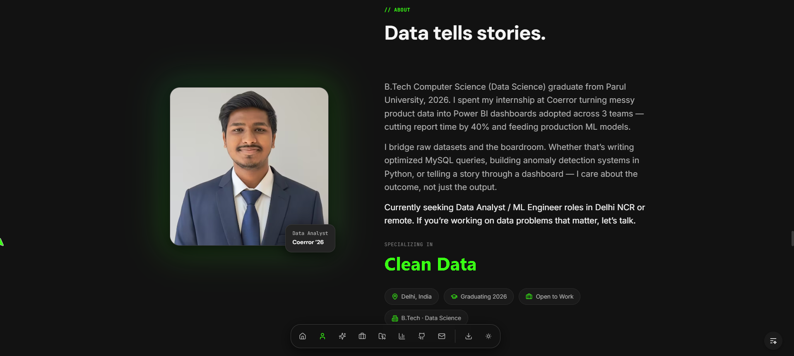

#### 3. **Skills Section**
- Categorized skills: Analytics, Programming, Databases, Tools, Soft Skills
- Icon badges with hover animations
- Responsive grid layout (1-4 columns per device)
- Skill level indicators (visual bars or badges)

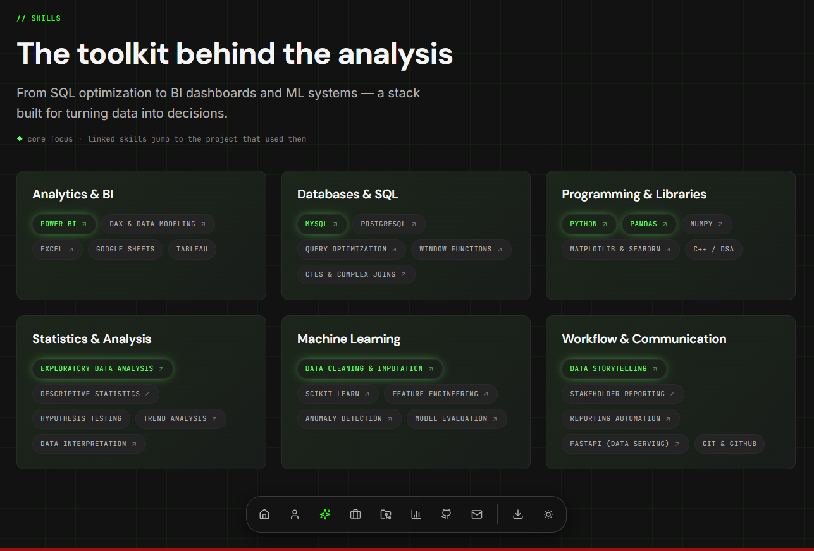

#### 4. **Experience Section**
- Timeline layout with company logos, titles, dates
- Role descriptions with bullet points
- Hover-triggered animations
- Filtering by role type (optional)

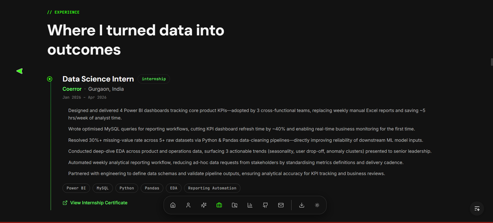

#### 5. **Education Section**
- B.Tech, certifications, course highlights
- Date ranges, GPA, key subjects
- Achievement badges

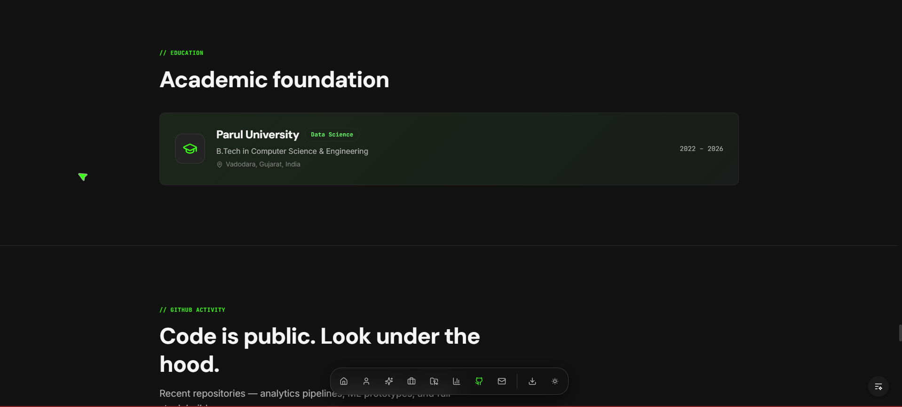

#### 6. **Certifications Section**
- Structured list of professional certifications
- Issuing authority, date, credential link
- Icons for each certification type
- Searchable / filterable (optional)

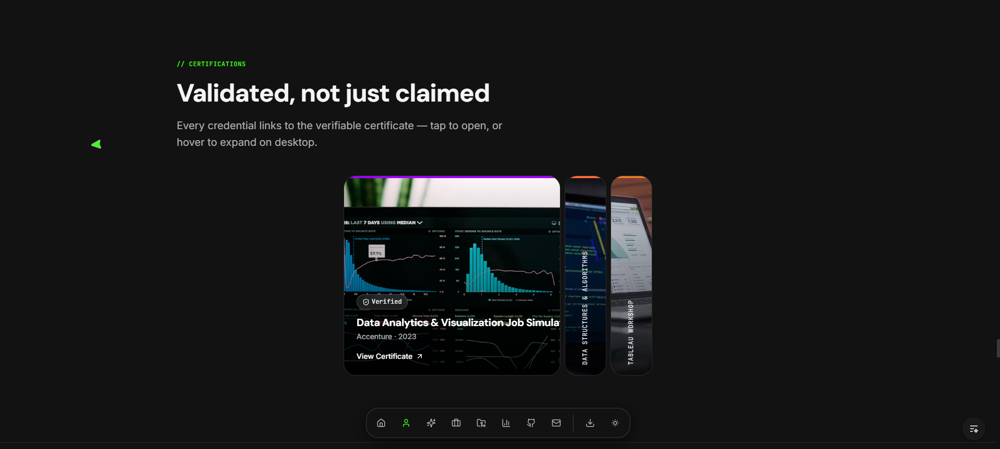

#### 7. **Projects Section**
- Hero project with large cover image, description, tech stack, live/GitHub links
- Grid of smaller project cards (3-4 columns)
- Lazy-loaded images with blur-up effect
- Tech badges, status (featured, archived), view count

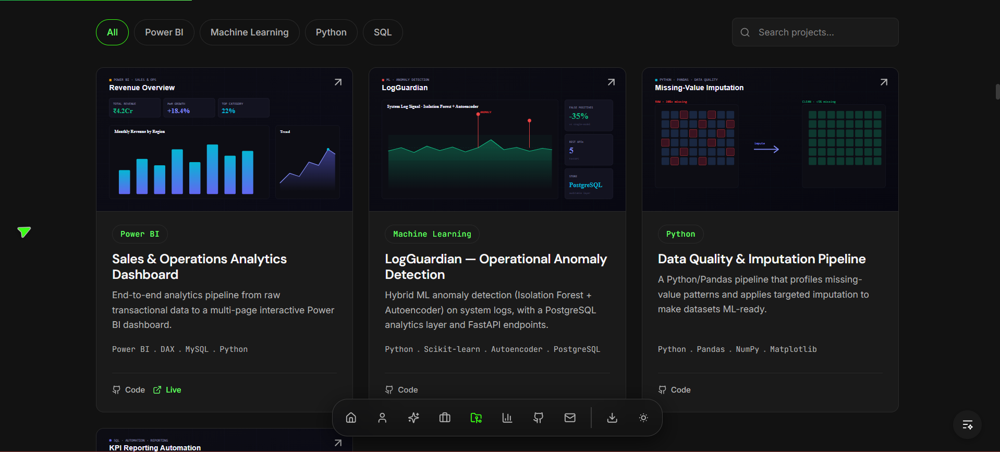

#### 8. **Featured Project Deep-Dive**
- High-resolution screenshot, full description
- Problem statement, solution approach, results/metrics
- Tech stack breakdown
- Links to live demo, GitHub repo, case study

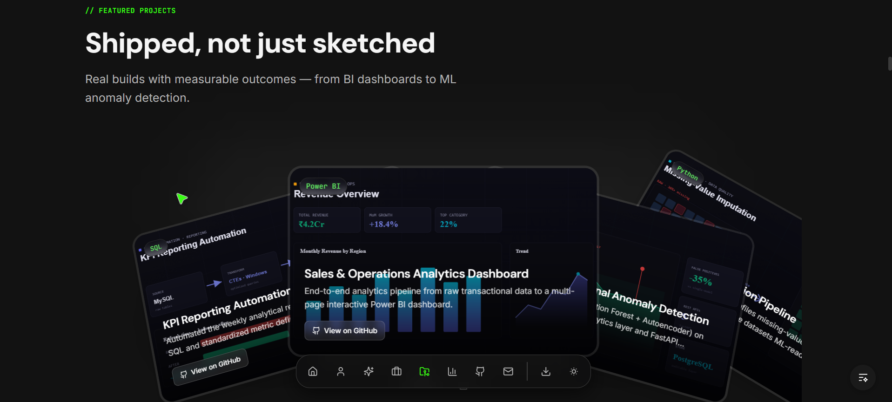

#### 9. **Dashboard & Analytics Showcase**
- Portfolio of Power BI / Tableau dashboards
- Screenshot carousel or grid
- Metrics: data processed, KPIs tracked, impact
- Links to live dashboards or reports

#### 10. **Case Studies & Data Storytelling**
- Deep-dive articles on analytics projects
- Problem → Solution → Results narrative
- Charts, screenshots, SQL queries, code snippets
- Downloadable insights (optional PDF)

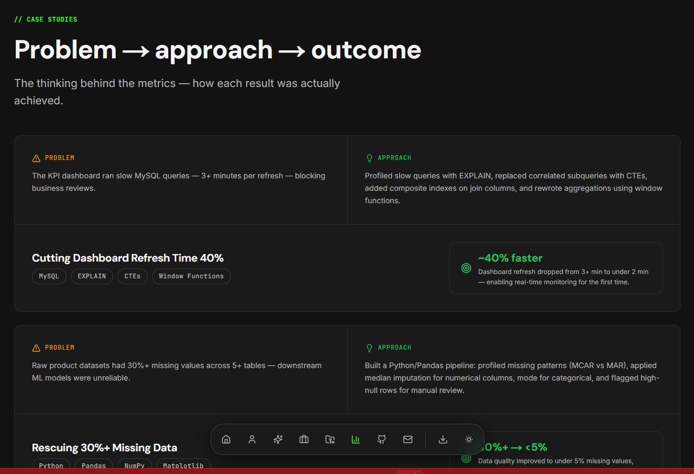

#### 11. **Tech Stack Section**
- Categorized technology breakdown
- Frontend, Backend, Databases, Tools, DevOps
- Logos or text badges
- Proficiency level (Expert, Intermediate, Learning)

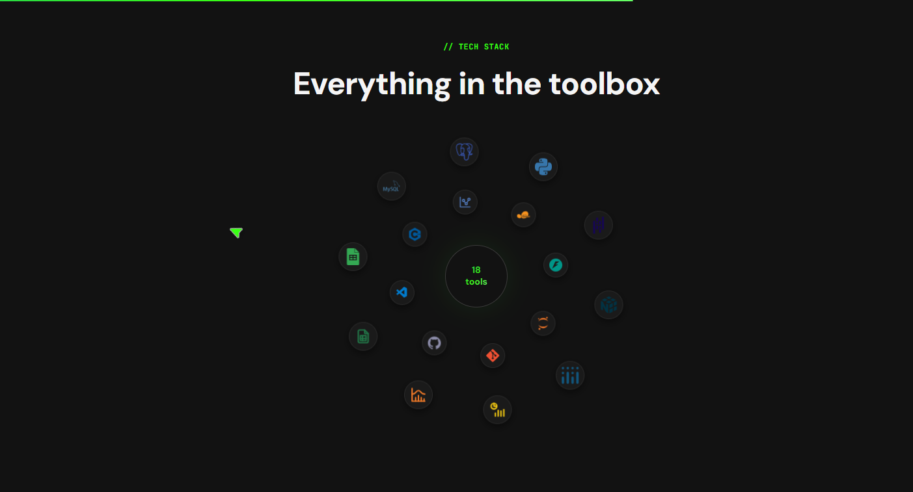

#### 12. **Achievements & Awards**
- Hackathon wins, competitions, scholarships
- Date, title, awarding organization
- Impact metrics or prize amount
- Animated counters for aggregate stats

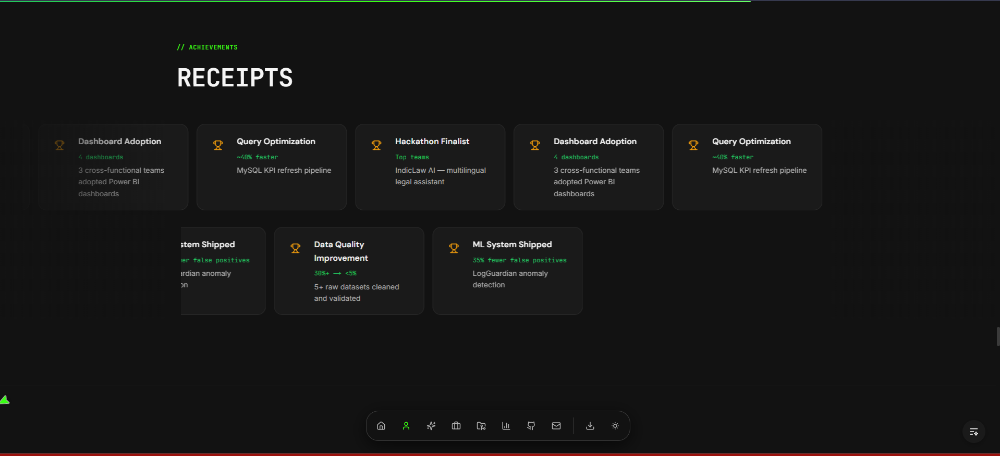

#### 13. **GitHub Activity Feed**
- Fetches top repos from GitHub API
- Shows stars, forks, language, description
- Links to live repo or live demo
- Sync frequency: ISR (On-Demand Revalidation)

#### 14. **Testimonials**
- Social proof from peers, managers, or stakeholders
- Name, title, quote, photo
- Star rating (optional)
- Carousel or grid layout

#### 15. **FAQ Section**
- Common recruiter questions answered
- Accordion component for clean UX
- Topics: availability, relocation, salary, tech stack, work style

#### 16. **Contact Form**
- Name, email, subject, message fields
- Zod validation on client & server
- Resend API integration for email
- Success/error toast notifications
- Rate limiting (1 email per 60 sec per IP)

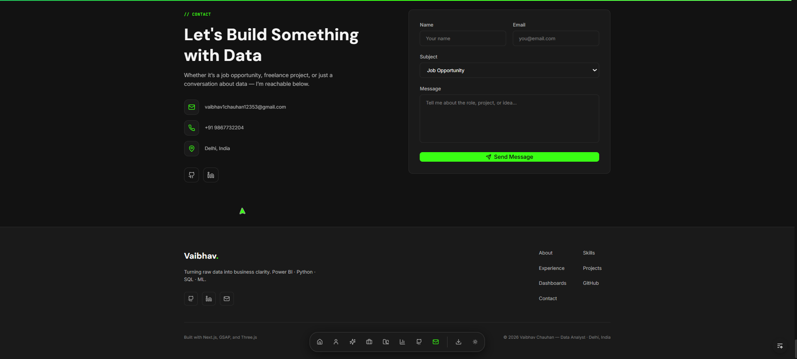

#### 17. **Sticky Navigation & Footer**
- Sticky header with dark/light theme toggle
- Mobile hamburger menu with smooth slide-in
- Footer with social links, copyright, sitemap links

---

## Project Structure

```
Data-Analytics-Portfolio/
├── app/
│   ├── layout.tsx                 # Root layout, providers wrapper
│   ├── page.tsx                   # Main portfolio page (RSC)
│   ├── api/
│   │   └── contact/route.ts       # POST /api/contact (Resend email)
│   ├── sitemap.ts                 # Dynamic sitemap for SEO
│   ├── robots.ts                  # robots.txt
│   └── opengraph-image.tsx        # Dynamic OG image generator
│
├── components/
│   ├── AgentationProvider.tsx     # External agent integration
│   ├── layout/
│   │   ├── Navbar.tsx             # Top navigation
│   │   ├── MobileMenu.tsx         # Mobile hamburger menu
│   │   ├── FloatingDock.tsx       # Bottom floating action bar
│   │   ├── Footer.tsx             # Site footer
│   │   ├── ScrollProgress.tsx     # Scroll progress bar
│   │   └── BackgroundController.tsx # Dynamic background
│   ├── providers/
│   │   ├── ThemeProvider.tsx      # next-themes wrapper
│   │   ├── SmoothScroll.tsx       # Lenis + GSAP integration
│   │   └── PerformanceProvider.tsx # Device tier detection
│   ├── shared/
│   │   ├── SectionHeader.tsx      # Title + subtitle + reveal animation
│   │   ├── RevealText.tsx         # Text reveal on scroll
│   │   ├── Reveal.tsx             # Generic reveal wrapper
│   │   ├── AnimatedCounter.tsx    # Count-up animation
│   │   ├── CursorGlow.tsx         # Custom cursor effect
│   │   ├── ThemeToggler.tsx       # Dark/light mode toggle
│   │   └── SectionLabel.tsx       # "SECTION 01" badge
│   ├── sections/
│   │   ├── Hero.tsx               # Hero + Spline 3D
│   │   ├── About.tsx              # Bio + stats
│   │   ├── KPIStats.tsx           # Counters (experience, projects, etc.)
│   │   ├── Skills.tsx             # Skills grid
│   │   ├── Experience.tsx         # Timeline layout
│   │   ├── Education.tsx          # Education cards
│   │   ├── Certifications.tsx     # Certification list
│   │   ├── Projects/
│   │   │   ├── FeaturedProject.tsx
│   │   │   ├── ProjectCard.tsx
│   │   │   └── ProjectGrid.tsx
│   │   ├── DashboardShowcase.tsx  # Dashboard carousel
│   │   ├── CaseStudies.tsx        # Case study cards
│   │   ├── DataStorytelling.tsx   # Long-form articles
│   │   ├── GitHub.tsx             # GitHub activity feed
│   │   ├── TechStack.tsx          # Technology breakdown
│   │   ├── Achievements.tsx       # Awards + achievements
│   │   ├── Testimonials.tsx       # Social proof carousel
│   │   ├── FAQ.tsx                # Accordion FAQ
│   │   └── Contact.tsx            # Contact form
│   ├── magicui/                   # Animated component library
│   │   ├── animated-shiny-text.tsx
│   │   ├── bento-grid.tsx
│   │   ├── dock.tsx
│   │   ├── marquee.tsx
│   │   ├── morphing-text.tsx
│   │   ├── orbiting-circles.tsx
│   │   └── ...
│   └── ui/
│       ├── Button.tsx             # Primary button component
│       └── Badge.tsx              # Badge component
│
├── lib/
│   ├── config.ts                  # Site config (name, links, feature flags)
│   ├── utils.ts                   # Utility functions (cn, etc.)
│   ├── fonts.ts                   # Font imports (Google Fonts, Geist)
│   ├── gsap.ts                    # GSAP animation helpers
│   ├── github.ts                  # GitHub API wrapper
│   ├── schema.ts                  # Zod schemas (form validation)
│   ├── performance/
│   │   ├── index.ts               # Performance hook + context
│   │   └── detector.ts            # Device tier detection logic
│   └── data/
│       ├── projects.ts            # Project data array
│       ├── skills.ts              # Skills categories
│       ├── experience.ts          # Work experience timeline
│       ├── education.ts           # Education history
│       ├── certifications.ts      # Certifications list
│       ├── dashboards.ts          # Dashboard portfolio
│       ├── case-studies.ts        # Case study articles
│       ├── tech-stack.ts          # Technology breakdown
│       ├── achievements.ts        # Awards + achievements
│       ├── testimonials.ts        # Social proof quotes
│       └── faq.ts                 # FAQ Q&A pairs
│
├── styles/
│   ├── globals.css                # Tailwind + design tokens (CSS variables)
│   └── ...                        # Additional global styles
│
├── public/
│   ├── avatar/
│   │   └── profile.jpg            # Profile photo
│   ├── projects/
│   │   └── *.webp                 # Project cover images
│   ├── dashboards/
│   │   └── *.webp                 # Dashboard screenshots
│   ├── resume/
│   │   └── Vaibhav_Chauhan_Resume.pdf
│   ├── *.png                      # Section screenshots (copied from Assets)
│   └── ...
│
├── Docs/
│   └── image-specs.md             # Image dimension requirements
│
├── Assets/
│   ├── screenshots/               # Source screenshots
│   ├── myphoto.jpeg               # Profile photo source
│   └── ...
│
├── .claude/                       # Claude Code config (hooks, settings)
├── .env.example                   # Environment template
├── .env.local                     # Secrets (not in git)
├── .eslintrc.json                 # ESLint config
├── .gitignore
├── next.config.mjs                # Next.js config
├── tailwind.config.ts             # Tailwind + design tokens
├── tsconfig.json                  # TypeScript config
├── postcss.config.mjs             # PostCSS config
├── components.json                # shadcn/ui config
├── package.json
├── package-lock.json
└── README.md & README_DETAILED.md
```

---

## Quick Start

### Prerequisites
- **Node.js 18+** (LTS recommended)
- **npm** or **yarn**
- A Resend account (optional for live email)

### Installation

```bash
# 1. Clone the repository
git clone https://github.com/vaibhavchauhan-15/data-analytics-portfolio.git
cd data-analytics-portfolio

# 2. Install dependencies
npm install

# 3. Copy environment template
cp .env.example .env.local

# 4. Add environment variables (see below)
# Edit .env.local and fill in:
# - RESEND_API_KEY (optional for local dev)
# - GITHUB_TOKEN (optional)
# - CONTACT_TO_EMAIL (optional)

# 5. Start dev server
npm run dev

# 6. Open in browser
# → http://localhost:3000
```

### Build & Deploy

```bash
# Production build
npm run build

# Start production server locally
npm run start

# Deploy to Vercel (recommended)
# → Connect GitHub repo to Vercel
# → Add env vars in Vercel dashboard
# → Auto-deploy on push
```

---

## Environment Setup

### Environment Variables

Create a `.env.local` file in the root directory:

```env
# Resend Email API (Required for live email)
RESEND_API_KEY=re_xxxxxxxxxxxxxxxxxxxxxx

# GitHub API (Optional, raises rate limit from 60 to 5000 req/hr)
GITHUB_TOKEN=ghp_xxxxxxxxxxxxxxxxxxxxxx

# Contact Form Email (Optional, defaults to email in config.ts)
CONTACT_TO_EMAIL=your-email@example.com
```

### Getting API Keys

#### 1. **Resend (Transactional Email)**
- Sign up at [resend.com](https://resend.com)
- Create API key in dashboard
- Paste into `.env.local`
- **Test locally:** Contact form won't fail without it, but email won't send

#### 2. **GitHub Token (Optional)**
- Go to GitHub → Settings → Developer settings → Personal access tokens
- Create "Classic" token with `public_repo` scope
- Paste into `.env.local`
- **Why:** GitHub API allows 60 unauthenticated requests/hour; with token: 5000/hour

#### 3. **Contact Recipient Email**
- Default: email from `lib/config.ts`
- Override in `.env.local` to send to a different address

---

## Portfolio Sections

### Editing Content

All portfolio content is stored in **plain TypeScript files** — no CMS, no database.

#### 1. **Site Metadata** (`lib/config.ts`)
```typescript
export const SITE_CONFIG = {
  name: 'Vaibhav Chauhan',
  title: 'Data Analyst · Power BI · Python · SQL',
  description: '...',
  email: 'vaibhav1chauhan12353@gmail.com',
  phone: '+91 9867732204',
  location: 'Delhi, India',
  url: 'https://vaibhavchauhan.dev',
  linkedin: '...',
  github: '...',
  kaggle: '...',
  resumeUrl: '/resume/Vaibhav_Chauhan_Resume.pdf',
  showTestimonials: true,
  showFAQ: true,
  showBlog: false,
  showKaggle: false,
  showDataStorytelling: true,
}
```

#### 2. **Navigation Links** (`lib/config.ts`)
```typescript
export const NAV_LINKS: NavLink[] = [
  { label: 'About', href: '#about' },
  { label: 'Skills', href: '#skills' },
  // ...
]
```

#### 3. **Skills** (`lib/data/skills.ts`)
```typescript
export const SKILLS = [
  {
    category: 'Analytics',
    items: [
      { name: 'Power BI', level: 'Expert', icon: 'database' },
      { name: 'Tableau', level: 'Intermediate', icon: 'chart' },
      // ...
    ],
  },
  // ...
]
```

#### 4. **Projects** (`lib/data/projects.ts`)
```typescript
export const PROJECTS = [
  {
    id: 'log-guardian',
    title: 'Log Guardian — Real-Time Log Analytics',
    description: '...',
    featured: true,
    image: '/projects/log-guardian.webp',
    tags: ['Power BI', 'Python', 'SQL'],
    links: {
      github: 'https://github.com/...',
      live: 'https://...',
    },
    metrics: {
      impact: '2000+ logs analyzed',
      timeToInsight: '< 10 seconds',
    },
  },
  // ...
]
```

#### 5. **Experience** (`lib/data/experience.ts`)
```typescript
export const EXPERIENCE = [
  {
    company: 'Company Name',
    logo: '/logos/company.png',
    title: 'Data Analyst',
    startDate: '2024-01-01',
    endDate: null, // null = current
    description: '...',
    highlights: ['Led analytics team', 'Built 5+ dashboards'],
  },
  // ...
]
```

#### 6. **Feature Flags** (in `lib/config.ts`)
```typescript
showTestimonials: true,    // Toggle testimonials section
showFAQ: true,             // Toggle FAQ accordion
showBlog: false,           // Toggle blog posts (not yet implemented)
showKaggle: false,         // Toggle Kaggle section
showDataStorytelling: true, // Toggle case studies / data storytelling
```

---

## Customization Guide

### 1. **Change Colors & Tokens** (`styles/globals.css`)
```css
:root {
  /* Primary accent color (adjust to your brand) */
  --primary: 59 130 246;      /* Blue-500 */
  --primary-dark: 37 99 235;  /* Blue-600 */
  
  /* Backgrounds */
  --bg-primary: 15 23 42;     /* Slate-900 */
  --bg-secondary: 30 41 59;   /* Slate-800 */
  
  /* Text */
  --text-primary: 248 250 252;     /* Slate-50 */
  --text-secondary: 148 163 184;   /* Slate-400 */
}

@media (prefers-color-scheme: light) {
  :root {
    --primary: 37 99 235;
    --bg-primary: 255 255 255;
    --text-primary: 15 23 42;
  }
}
```

### 2. **Update Profile Photo**
```bash
# Replace or add new photo
cp /path/to/profile.jpg public/avatar/profile.jpg
```

### 3. **Add Project Cover Images**
```bash
# Save 16:9 WebP images (1600×900px recommended)
cp /path/to/project-1.webp public/projects/project-1.webp
```

### 4. **Update Resume PDF**
```bash
cp /path/to/Resume.pdf public/resume/Vaibhav_Chauhan_Resume.pdf
```

### 5. **Customize Fonts** (`lib/fonts.ts`)
```typescript
import { Geist, Geist_Mono } from 'next/font/google'

const geist = Geist({
  subsets: ['latin'],
  display: 'swap',
  weight: ['400', '500', '600', '700'],
})

export const fontStack = `${geist.variable}, system-ui, -apple-system, sans-serif`
```

### 6. **Add New Sections**
1. Create component in `components/sections/`
2. Add data file in `lib/data/`
3. Import & render in `app/page.tsx`

Example:
```typescript
// components/sections/Awards.tsx
export function Awards() {
  const awards = AWARDS.filter(a => !a.hidden)
  return (
    <section id="awards" className="py-16">
      <SectionHeader title="Awards & Honors" />
      {/* Render awards */}
    </section>
  )
}
```

---

## Performance & Accessibility

### 🚀 Performance Optimizations

#### 1. **Adaptive Rendering Engine**
The portfolio detects device capabilities and adapts features accordingly:

```typescript
// usePerformance() hook returns device tier (0-4)
const tier = useTier()

// Tier 0: Ultra-high (MacBook Pro, gaming PC)
// Tier 1: High (mid-range laptop, tablet)
// Tier 2: Medium (older laptop, budget phone)
// Tier 3: Low (old phone, low-end device)
// Tier 4: Ultra-low (IoT, very old device)

// Conditional rendering based on tier
if (tier <= 1) {
  return <SplineHero /> // 3D scene
} else {
  return <GradientHero /> // Static fallback
}
```

**Features gated by tier:**
- ✅ Spline 3D hero (tier 0-1)
- ✅ Lenis smooth scroll (tier 0-2)
- ✅ Framer Motion animations (tier 0-3)
- ✅ GSAP ScrollTrigger (all tiers, but reduced on low-end)
- ✅ Blur effects (tier 0-1)
- ✅ Custom cursors (tier 0-2)
- ✅ Infinite CSS loops (tier 0-2)

**Test performance tier:**
```
http://localhost:3000/?perf=0  # Force tier 0 (ultra-high)
http://localhost:3000/?perf=3  # Force tier 3 (low)
```

#### 2. **Image Optimization**
- Next.js `<Image>` component with lazy loading
- WebP format with JPEG fallback
- `blur="placeholder"` for perceived performance
- Responsive `sizes` attribute

#### 3. **Code Splitting**
- Spline hero: dynamic import with `ssr: false`
- Route-based code splitting (Next.js App Router)
- Component lazy-loading with React.lazy()

#### 4. **Font Loading**
- `display: 'swap'` to show fallback while font loads
- Preload critical font weights
- Google Fonts with HTTPS

#### 5. **Lighthouse Targets**
- **Performance:** ≥ 90
- **Accessibility:** ≥ 90
- **Best Practices:** ≥ 90
- **SEO:** ≥ 95

### ♿ Accessibility

#### 1. **Keyboard Navigation**
- All interactive elements are keyboard-accessible
- Focus visible rings on all buttons/links
- Skip-to-content link (hidden unless focused)
- Logical tab order (DOM order)

#### 2. **Screen Reader Support**
- Semantic HTML (`<header>`, `<nav>`, `<main>`, `<footer>`, `<section>`)
- ARIA labels on icon buttons
- Form labels properly associated with inputs
- Alt text on all images

#### 3. **Motion Preferences**
- All animations are disabled if user has `prefers-reduced-motion` enabled
- GSAP checks: `gsap.config({ autoSleep: 0 })`
- Framer Motion respects preference
- No auto-playing videos or animations

#### 4. **Color Contrast**
- Text ≥ 4.5:1 contrast ratio (AA standard)
- Focus indicators ≥ 3:1 contrast
- Color not sole means of conveying info

#### 5. **Form Validation**
- Clear error messages displayed below input
- `aria-invalid` & `aria-describedby` attributes
- Real-time validation feedback (optional)

---

## Deployment

### Vercel (Recommended)

1. **Push to GitHub**
   ```bash
   git add .
   git commit -m "Initial commit"
   git push origin main
   ```

2. **Import into Vercel**
   - Go to [vercel.com](https://vercel.com)
   - Click "New Project"
   - Select GitHub repo
   - Framework: Next.js (auto-detected)
   - Root directory: `.` (default)

3. **Add Environment Variables**
   - In Vercel dashboard: Settings → Environment Variables
   - Add: `RESEND_API_KEY`, `GITHUB_TOKEN`, `CONTACT_TO_EMAIL`
   - Deploy triggers automatically on git push

4. **Enable Vercel Analytics** (optional)
   - Dashboard → Analytics
   - Enable "Web Vitals"
   - Auto-collected: LCP, FID, CLS, TTFB

### Other Platforms

#### **Netlify**
```bash
npm run build
# → Deploy `out` or `.next` folder
```

#### **Docker**
```dockerfile
FROM node:18-alpine
WORKDIR /app
COPY . .
RUN npm install && npm run build
CMD ["npm", "start"]
```

#### **Self-Hosted (VPS)**
```bash
npm run build
npm start  # Runs on port 3000
# Use nginx/Apache as reverse proxy
```

---

## Content Checklist

Before deploying, ensure all assets are in place:

- [ ] Profile photo: `public/avatar/profile.jpg`
- [ ] Project covers: `public/projects/*.webp` (16:9)
- [ ] Dashboard screenshots: `public/dashboards/*.webp` (16:9)
- [ ] Resume PDF: `public/resume/Vaibhav_Chauhan_Resume.pdf`
- [ ] All data files updated in `lib/data/`
- [ ] `lib/config.ts` updated with correct links & feature flags
- [ ] Social links correct (LinkedIn, GitHub, Kaggle)
- [ ] Contact email set in `.env.local` or `lib/config.ts`
- [ ] Resume URL matches file name in `public/resume/`
- [ ] All screenshots tested on mobile & desktop

---

## Scripts

```bash
npm run dev          # Start dev server (hot reload)
npm run build        # Production build
npm start            # Start production server
npm run lint         # Run ESLint
npm run type-check   # TypeScript type checking
```

---

## File Sizing

### Image Assets
| File | Typical Size | Format |
|------|--------------|--------|
| Profile photo | 100-200 KB | JPEG or WebP |
| Project cover | 200-400 KB | WebP (1600×900) |
| Dashboard screenshot | 300-600 KB | WebP or PNG |
| Section screenshot | 200-500 KB | PNG or WebP |

**Optimization tip:** Use [TinyPNG](https://tinypng.com) or [Squoosh](https://squoosh.app) to compress images.

---

## Troubleshooting

### Build Fails with `ENOENT: no such file or directory`
- Ensure all files in `lib/data/` exist
- Check for missing imports in `app/page.tsx`

### Images Not Loading
- Verify files are in `public/` (not `src/public/`)
- Check file extensions (.webp, .jpg, .png)
- Clear Next.js cache: `rm -rf .next && npm run dev`

### Email Not Sending
- Verify `RESEND_API_KEY` is set and valid
- Check console for error logs
- Resend account email verified?
- Rate limiting? (1 email per 60 sec per IP)

### Animations Jittery on Mobile
- Set performance tier: `?perf=3`
- Animations auto-disable if tier > 2

### GitHub Feed Not Updating
- Check `GITHUB_TOKEN` is set
- GitHub API rate limit? (check Resend logs)
- ISR revalidate time set to 3600s (1 hour)

---

## Future Enhancements

- [ ] Blog section (`showBlog: true`) with Markdown support
- [ ] Kaggle portfolio integration
- [ ] Dark/light mode toggle for individual sections
- [ ] Comment section on case studies
- [ ] Live chat integration
- [ ] Newsletter signup
- [ ] Job board or "Open to Work" badge
- [ ] Advanced analytics dashboard
- [ ] Multi-language support (i18n)

---

## Contributing

This is a personal portfolio, but improvements are welcome:

1. Fork the repo
2. Create a feature branch: `git checkout -b feature/your-feature`
3. Commit changes: `git commit -m "Add your feature"`
4. Push to branch: `git push origin feature/your-feature`
5. Open a Pull Request

---

## License

This project is **MIT Licensed**. Feel free to use it as a template for your own portfolio, but please:
- Remove my personal info (name, email, links, resume)
- Update all content to reflect your own experience
- Give credit if you use this design template publicly

---

## Contact & Support

- **Email:** vaibhav1chauhan12353@gmail.com
- **LinkedIn:** [vaibhavchauhan15](https://www.linkedin.com/in/vaibhavchauhan15/)
- **GitHub:** [@vaibhavchauhan-15](https://github.com/vaibhavchauhan-15)

---

## Screenshots

### Full Portfolio Flow

**Hero Section**


**About & Stats**


**Skills**


**Experience**


**Education**


**Certifications**


**Projects**


**Featured Project Detail**


**Case Study**


**Tech Stack**


**Achievements**


**Contact & Footer**


---

**Last updated:** July 2026  
**Portfolio Status:** Active & Maintained  
**Next deploy:** Push to main → Auto-deploy to Vercel
